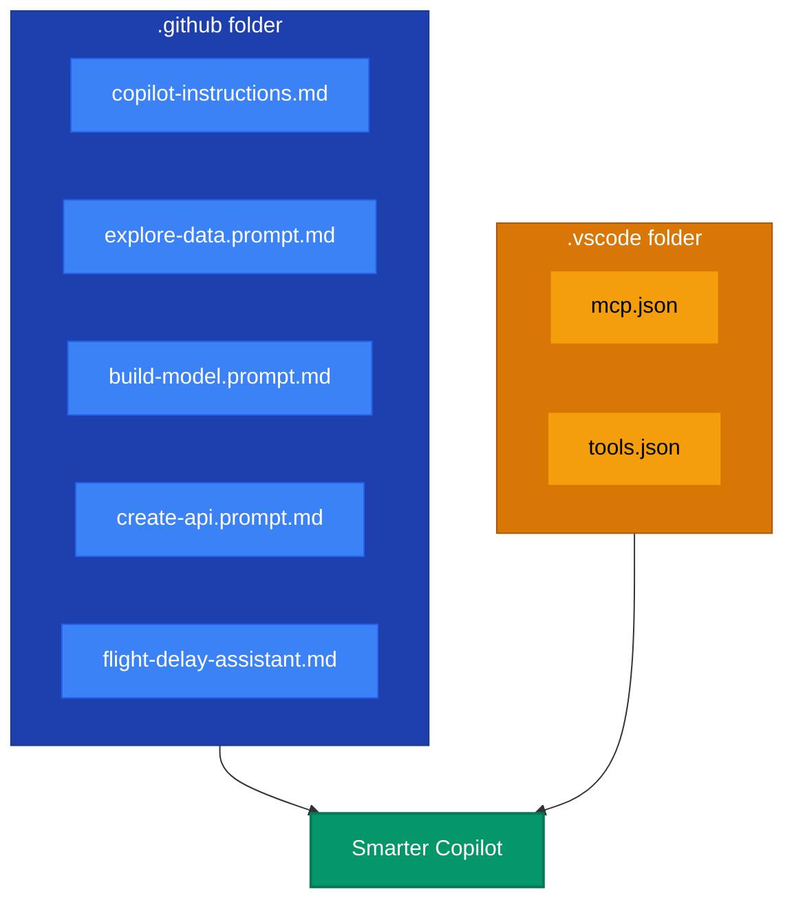

# 🔧 GitHub Copilot Power-Ups

> Pre-configured Copilot features to boost your productivity in this hackathon

---

## 📋 What's Here

This folder contains **7 Copilot configuration files** that are already active. They give Copilot deep knowledge about your project, making its suggestions more accurate and relevant.



---

## 📁 File Reference

### 1. Chat Instructions ([`copilot-instructions.md`](./copilot-instructions.md))

**What it does**: Provides project context that Copilot reads for ALL conversations.

**Technical details**:
- Automatically loaded by Copilot when you open this workspace
- Contains: dataset columns, tech stack, API specs, coding standards
- No action needed - it's always active

**Try it**:
```
Open Copilot Chat and ask: "What columns are in flights.csv?"
Copilot will answer accurately because it reads this file.
```

---

### 2. Prompt Files ([`prompts/`](./prompts/) folder)

**What they do**: Reusable prompts you invoke with a single command.

| File | Command | Purpose |
|------|---------|--------|
| [`explore-data.prompt.md`](./prompts/explore-data.prompt.md) | `#explore-data` or `/explore-data` | Data exploration code |
| [`build-model.prompt.md`](./prompts/build-model.prompt.md) | `#build-model` or `/build-model` | ML pipeline guidance |
| [`create-api.prompt.md`](./prompts/create-api.prompt.md) | `#create-api` or `/create-api` | Flask API generation |

**How to invoke** (both work!):
- `#` (hash) - Attaches prompt as context, you can add more to your message
- `/` (slash) - Runs the prompt directly as a command

**Technical details**:
- Type `#filename` or `/filename` in Copilot Chat (without `.prompt.md`)
- The prompt content is sent to Copilot as context
- Copilot generates code based on the prompt specifications

**Try it**:
```
1. Open Copilot Chat (Ctrl+Shift+I)
2. Type: #explore-data  (or /explore-data)
3. Press Enter
4. Copilot generates data analysis code for flights.csv
```

---

### 3. Custom Agent ([`agents/flight-delay-assistant.md`](./agents/flight-delay-assistant.md))

**What it does**: Creates a specialized Copilot agent for this project.

**Technical details**:
- Access via the **agent dropdown menu** in Copilot Chat
- Knows: dataset structure, project goals, tech stack, file locations
- Provides project-specific answers vs generic advice

**How to use**:
1. Open Copilot Chat (`Ctrl+Shift+I`)
2. Click the **dropdown menu** at the top (shows "Ask" or "Edit" mode)
3. Choose **"flight-delay-assistant"** from the agent list
4. Ask your question!

**Try it**:
```
Select flight-delay-assistant agent, then ask:
"What's the target variable for my model?"

Answer: "The target is ArrDel15, a binary column where 1 = delayed >15 min"
(vs generic: "For classification, you need a target variable...")
```

> 💡 **Tip: Enable `@` prefix for agents**
> 
> Want to type `@flight-delay-assistant` directly in chat? Enable this setting:
> 1. Open Settings (`Ctrl+,`)
> 2. Search for: `chat.customAgentInSubagent`
> 3. Enable **"Chat › Custom Agent In Subagent"**
> 4. Restart VS Code
> 
> Now you can type `@flight-delay-assistant` alongside `@workspace`, `@terminal`, etc.!

---

### 4. MCP Server ([`.vscode/mcp.json`](../.vscode/mcp.json))

**What it does**: Extends Copilot with external tool capabilities via Model Context Protocol.

**Currently configured**: Filesystem server
- Allows Copilot to read/write files directly
- Enables deeper analysis of large files like `flights.csv`

#### ⚠️ Setup Required (One-Time)

The MCP filesystem server must be started manually:

**Step 1: Verify Node.js is installed**
```bash
node --version
```
> If not installed, download from [nodejs.org](https://nodejs.org/)

**Step 2: Start the MCP Server**
1. Open Command Palette (`Ctrl+Shift+P`)
2. Type: **`MCP: List Servers`**
3. You should see `filesystem` in the list
4. If it shows "Not Running", click **`Start Server`** to start it

**Step 3: Verify MCP is Running**
1. Open Command Palette (`Ctrl+Shift+P`)
2. Type: **`MCP: List Servers`**
3. Look for: `filesystem` with status **Running** ✅

#### 🔍 How to See MCP in Action
1. Open **Output** panel (`Ctrl+Shift+U`)
2. Select **`GitHub Copilot Chat - MCP`** from dropdown
3. Ask Copilot to read a file - you'll see MCP logs!

**Try it**:
```
Ask Copilot: "Use MCP to list all files in the data folder"
Watch the Output panel to see MCP being called!
```

---

### 5. Tool Sets ([`.vscode/tools.json`](../.vscode/tools.json))

**What it does**: Controls what actions Copilot can perform.

**Currently enabled**:
| Tool | Status | Description |
|------|--------|-------------|
| `read_file` | ✅ ON | Read any file in workspace |
| `write_file` | ✅ ON | Create and edit files |
| `run_terminal` | ✅ ON | Execute terminal commands |
| `run_notebook_cell` | ✅ ON | Run Jupyter notebook cells |
| `semantic_search` | ✅ ON | Search codebase semantically |
| `grep_search` | ✅ ON | Search with regex patterns |

---

## 🧪 Quick Experiments

Test each feature to see how they work:

### Experiment 1: Context Awareness
```
Ask: "Help me load the dataset"

Without copilot-instructions.md: Generic pandas code
With copilot-instructions.md: Uses 'data/flights.csv' path automatically
```

### Experiment 2: Prompt Files
```
Type: #build-model

Copilot generates complete ML pipeline with:
- DayOfWeek and DestAirportID as features
- ArrDel15 as target
- Logistic Regression
- Save to server/model.pkl
```

### Experiment 3: Custom Agent
```
Type: @flight-delay-assistant How do I handle null values?

Gets project-specific advice about DepDel15 nulls
```

---

## 📊 Impact Comparison

| Without These Files | With These Files |
|---------------------|------------------|
| Generic Python/Flask advice | Project-specific suggestions |
| You explain context every time | Copilot remembers context |
| Long prompts for each task | One command: `#explore-data` |
| Manual file path typing | Correct paths automatically |

---

## 🔧 Customization

As you work, you can enhance these files:

### Add to `copilot-instructions.md`:
```markdown
## My Discoveries
- Delay rate is highest on Friday
- Airport 10397 has 28% delay rate
```

### Create new prompt files:
Create `prompts/my-task.prompt.md` for any repeated task.

### Update the agent:
Add your learnings to `agents/flight-delay-assistant.md`.

---

## ➡️ Return to Hackathon

> ### [👉 Back to Main Hackathon Guide](../hackathon.md)
