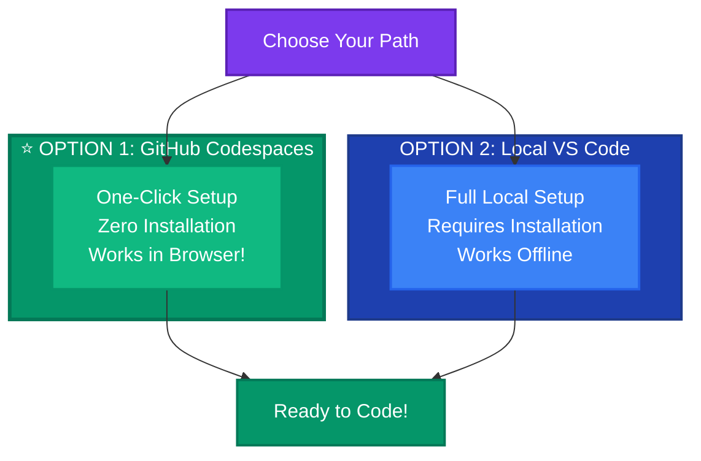

# ⚙️ Chapter 0: Prepare for the Quest

> *"Every great adventure begins with preparation. Before you can unlock the secrets of the FAA archives, you must first gather your tools and awaken your AI companion..."*

---

## 🗺️ The Story So Far

*You've accepted the challenge to become a Data Explorer. But before you can enter the Data Vault, you must:*

- ⚔️ **Forge your workspace** — Clone the sacred repository
- 🛡️ **Equip your tools** — Set up VS Code and Python
- 🤖 **Awaken Copilot** — Your AI companion who will guide you through the journey
- 🔑 **Discover the Power-Ups** — Secret configurations that make Copilot even more powerful

*Only when your environment is ready can you proceed to the Data Vault...*

---

## 🎯 What You'll Accomplish

By the end of this chapter, you'll have:
- ✅ Repository cloned to your local machine
- ✅ VS Code open with the project
- ✅ GitHub Copilot installed and working
- ✅ Python environment ready
- ✅ Discovered the Copilot power-ups

---

## 🚀 Choose Your Setup Path

You have **two options** to get started. Pick the one that works best for you:



| Option | Best For | Time to Start |
|--------|----------|---------------|
| **⭐ Option 1: Codespaces** | Managers, non-technical stakeholders, quick start | **~2 minutes** |
| **Option 2: Local VS Code** | Developers who prefer local setup | ~15 minutes |

---

# ⭐ OPTION 1: GitHub Codespaces (Recommended)

## 🌟 Zero Setup — Start Coding Instantly!

> **Perfect for:** Managers, business stakeholders, anyone who wants to jump straight into coding without installing anything!

GitHub Codespaces gives you a **complete development environment in your browser** — no installation required!

### Why Codespaces?

| Benefit | Description |
|---------|-------------|
| ✅ **No installation** | Everything runs in the cloud |
| ✅ **Works anywhere** | Just need a browser |
| ✅ **Pre-configured** | Python, extensions, all ready to go |
| ✅ **Copilot included** | Already installed and activated |
| ✅ **Same experience** | Identical to VS Code desktop |

---

### 🚀 Start Codespaces in 3 Clicks

#### Step 1: Open the Repository

Go to: **[github.com/gitpavleenbali/flight-delay-hackathon_exercise](https://github.com/gitpavleenbali/flight-delay-hackathon_exercise)**

#### Step 2: Launch Codespace

Click the green **"<> Code"** button → Select **"Codespaces"** tab → Click **"Create codespace on main"**


#### Step 3: Wait ~2 Minutes

Codespaces will:
- Create your cloud environment
- Install Python and all dependencies
- Set up GitHub Copilot
- Open VS Code in your browser

**That's it! You're ready to code! 🎉**

---

### ✅ Verify Codespaces is Working

1. Open Copilot Chat: Press `Ctrl+Shift+I` (or `Cmd+Shift+I` on Mac)
2. Ask: *"What columns are in flights.csv?"*
3. If Copilot responds with column info, **you're all set!**

> ### [👉 Skip to "Discover the Power-Ups" section](#-discover-the-power-ups)

---

# OPTION 2: Local VS Code Setup

## 🖥️ Full Local Installation

> **For:** Developers who prefer working locally with full control over their environment

---

## 📋 Prerequisites

Before starting, ensure you have:

| Requirement | How to Check | Install Link |
|-------------|--------------|--------------|
| **VS Code** | Open VS Code | [Download VS Code](https://code.visualstudio.com/) |
| **Python 3.8+** | `python --version` | [Download Python](https://www.python.org/downloads/) |
| **Git** | `git --version` | [Download Git](https://git-scm.com/) |
| **GitHub Copilot License** | Check your GitHub settings | [GitHub Copilot](https://github.com/features/copilot) |

---

## 🛠️ Step-by-Step Local Setup

### Local Step 1: Clone the Repository

Open a terminal and run:

```bash
git clone https://github.com/gitpavleenbali/flight-delay-hackathon_exercise.git
cd flight-delay-hackathon_exercise
```

---

### Local Step 2: Open in VS Code

```bash
code .
```

Or: Open VS Code → File → Open Folder → Select the cloned folder

---

### Local Step 3: Install GitHub Copilot Extension

1. Click the **Extensions** icon in VS Code sidebar (or press `Ctrl+Shift+X`)
2. Search for **"GitHub Copilot"**
3. Click **Install** on "GitHub Copilot" (by GitHub)
4. Also install **"GitHub Copilot Chat"**
5. Sign in to GitHub when prompted


---

### Local Step 4: Set Up Python Environment

Open a terminal in VS Code (`Ctrl+`` `) and run:

```bash
# Create virtual environment
python -m venv venv

# Activate it (Windows)
.\venv\Scripts\activate

# Activate it (Mac/Linux)
source venv/bin/activate

# Install dependencies
pip install pandas numpy scikit-learn matplotlib seaborn flask flask-cors jupyter
```

---

### Local Step 5: Verify Copilot is Working

1. Create a new file: `test.py`
2. Type this comment:
   ```python
   # Print hello world
   ```
3. Wait for Copilot to suggest code (gray text)
4. Press `Tab` to accept
5. If it works, **delete the test file** - you won't need it


---

### Local Step 6: Open Copilot Chat

Press `Ctrl+Shift+I` (Windows) or `Cmd+Shift+I` (Mac) to open Copilot Chat.

Try asking: *"What files are in this project?"*

---

## 🔑 Discover the Power-Ups

Before moving to Chapter 1, explore the **Copilot configurations** we've set up for you!

### What's Already Configured

| Location | File | What It Does |
|----------|------|--------------|
| `.github/` | `copilot-instructions.md` | Project context Copilot reads automatically |
| `.github/prompts/` | `*.prompt.md` files | Reusable prompts you can invoke |
| `.github/agents/` | `flight-delay-assistant.md` | Custom agent for this project |
| `.vscode/` | `mcp.json`, `tools.json` | Extended capabilities |

### Try These Commands Now

Open Copilot Chat and try:

| Command | What Happens |
|---------|--------------|
| *"What columns are in flights.csv?"* | Copilot answers using project context |
| `#explore-data` or `/explore-data` | Loads data exploration prompt |
| `@flight-delay-assistant What's the target variable?` | Agent answers with project knowledge |

> ### 👉 [Read the Full Power-Ups Guide](../.github/github-copilot-power-ups.md)

---

## ✅ Setup Complete Checklist

Before moving on, verify:

- [ ] Repository cloned and open in VS Code
- [ ] GitHub Copilot extension installed and signed in
- [ ] GitHub Copilot Chat extension installed
- [ ] Python virtual environment created and activated
- [ ] Required packages installed (pandas, sklearn, flask, etc.)
- [ ] Copilot suggests code when you type comments
- [ ] Copilot Chat responds to your questions

---

## 🔧 Troubleshooting

<details>
<summary><b>Copilot not suggesting code?</b></summary>

1. Check you're signed into GitHub in VS Code
2. Verify your Copilot license is active
3. Reload VS Code window (`Ctrl+Shift+P` → "Reload Window")
4. Check the Copilot icon in the status bar (bottom right)

</details>

<details>
<summary><b>Python packages not installing?</b></summary>

1. Make sure your virtual environment is activated
2. Check Python version: `python --version` (need 3.8+)
3. Try: `pip install --upgrade pip` then reinstall packages

</details>

<details>
<summary><b>Can't find the cloned folder?</b></summary>

1. Check your terminal's current directory: `pwd` (Mac/Linux) or `cd` (Windows)
2. The clone creates a folder named `flight-delay-hackathon` in your current directory

</details>

---

## ➡️ Next Chapter

Your environment is ready! Time to explore the data and build your ML model.

> ### [👉 Begin Chapter 1: Data & ML Model](./1-create-model-data.md)
