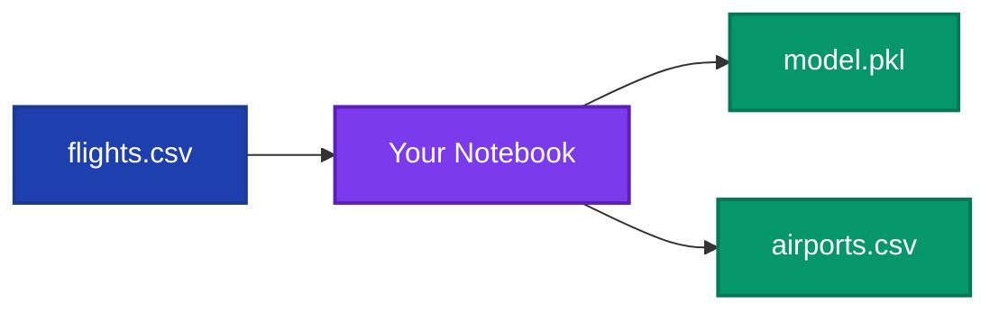
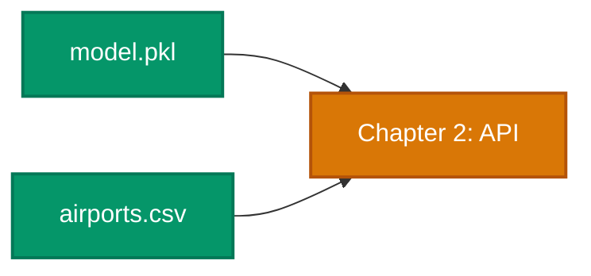

# 🔍 Chapter 1: Decode the Data

> *"Within the data vault lie 271,000 stories. Each flight a journey, each delay a pattern waiting to be discovered..."*

---

## 🎯 Your Mission

The FAA has entrusted you with their flight records. Your quest: **find the patterns** that predict delays and train an **Oracle** (machine learning model) to share this wisdom.



---

## 📜 The Quest

### 🏆 Success Criteria

You will complete this chapter when you have:

| Task | Reward |
|------|--------|
| ✅ Explored the dataset and understood its structure | *Knowledge of the data* |
| ✅ Cleaned the data (filled null values with 0) | *Pure, usable data* |
| ✅ Trained a model to predict flight delays | *🔮 The Oracle (model.pkl)* |
| ✅ Exported the airport list with IDs | *📋 The Index (airports.csv)* |

---

### 📂 First: Create the Server Folder

Before you begin, create the folder where you'll export your model:

```bash
mkdir server
```

Or right-click in VS Code Explorer → New Folder → name it `server`

---

### 📓 Your Notebook Structure

Create `manage-flight-data.ipynb` in the root folder. Here's the cell structure to follow:

| Cell # | Type | Purpose | What to Do |
|--------|------|---------|------------|
| 1 | Markdown | Title | "# Flight Delay Prediction Model" |
| 2 | Code | Imports | Import pandas, numpy, sklearn, pickle |
| 3 | Code | Load Data | `pd.read_csv('data/flights.csv')` |
| 4 | Markdown | Section | "## Data Exploration" |
| 5 | Code | Check Nulls | `df.isnull().sum()` |
| 6 | Markdown | Section | "## Data Cleaning" |
| 7 | Code | Clean Data | Fill nulls, remove outliers |
| 8 | Markdown | Section | "## Train Model" |
| 9 | Code | ML Pipeline | Train/test split, LogisticRegression |
| 10 | Code | Evaluate | Accuracy, confusion matrix |
| 11 | Markdown | Section | "## Export Artifacts" |
| 12 | Code | Export | Save model.pkl and airports.csv |

---

### ⚔️ Part 1: Enter the Data Vault

Create a Jupyter notebook to explore the data:

1. In the root of your project, create a new file: `manage-flight-data.ipynb`
2. The dataset is at `data/flights.csv`

**🧪 Try the Scroll of Analysis:**
```
Open Copilot Chat and type: #explore-data or /explore-data
Watch as it generates exploration code!
```

**Things to discover:**
- How many rows and columns?
- What do the columns mean?
- Are there null values?
- What's the overall delay rate?

---

### ⚔️ Part 2: Cleanse the Data

The data has impurities (null values). You must cleanse it before the Oracle can learn.

**Your task:**
- Find columns with null values
- Fill null values in `DepDel15` with 0
- Remove outliers if needed

**💡 Hint:** Ask Copilot: *"Help me find and fill null values in this dataset"*

---

### ⚔️ Part 3: Train the Oracle

Create a machine learning model that predicts flight delays.

**🧪 Try the Scroll of Creation:**
```
Open Copilot Chat and type: #build-model
Follow its guidance to build your ML pipeline!
```

**The Oracle should:**
- Use `DayOfWeek` and `DestAirportID` as features
- Predict `ArrDel15` (1 = delayed >15 min, 0 = on time)
- Use Logistic Regression (recommended)

---

### ⚔️ Part 4: Export Your Creations

Save your Oracle and Index for the next chapter:

| Artifact | Location | Purpose |
|----------|----------|---------|
| 🔮 `model.pkl` | `server/model.pkl` | The trained Oracle |
| 📋 `airports.csv` | `server/airports.csv` | Airport ID to name mapping |

**💡 Hint:** Use `pickle` or `joblib` to save the model

---

## 🗝️ Power-Ups to Use

| Artifact | Incantation | How It Helps |
|----------|-------------|--------------|
| 📊 Scroll of Analysis | `#explore-data` | Generates data exploration code |
| 🤖 Scroll of Creation | `#build-model` | Guides ML model creation |
| 🛫 Expert Spirit | `@flight-delay-assistant` | Answers project questions |

---

## 💡 Ancient Wisdom

<details>
<summary>📜 <b>Wisdom #1:</b> How to explore data</summary>

Start with these common steps:
```python
import pandas as pd

# Load the data
df = pd.read_csv('data/flights.csv')

# See the shape
print(df.shape)

# See first rows
df.head(10)

# Check for nulls
df.isnull().sum()
```

</details>

<details>
<summary>📜 <b>Wisdom #2:</b> Choosing features</summary>

For this quest, use:
- **Features (X)**: `DayOfWeek`, `DestAirportID`
- **Target (y)**: `ArrDel15`

These are the inputs and output for your Oracle!

</details>

<details>
<summary>📜 <b>Wisdom #3:</b> Saving the model</summary>

```python
import pickle

# Save the model
with open('server/model.pkl', 'wb') as f:
    pickle.dump(model, f)
```

</details>

---

## ✅ Chapter Complete!

When you have these artifacts, you've completed the chapter:



**Checklist:**
- [ ] Created `server/` folder
- [ ] Created `manage-flight-data.ipynb` notebook
- [ ] Explored and understood the dataset
- [ ] Cleaned null values (filled with 0)
- [ ] Removed outliers (90th percentile)
- [ ] Trained a Logistic Regression model
- [ ] Saved `model.pkl` to `server/`
- [ ] Created `airports.csv` in `server/`

---

## ➡️ Next Chapter

You've trained the Oracle. Now it's time to build a bridge so others can consult it...

> ### [🌉 Begin Chapter 2: Build the Bridge →](./2-create-api.md)

---

<details>
<summary>💡 <b>Stuck?</b> Here's help</summary>

**Don't know where to start?**
- Type `#explore-data` in Copilot Chat
- Ask `@flight-delay-assistant What should I do first?`

**Model not training?**
- Check that you removed null values
- Make sure X and y are correctly defined
- Try `#build-model` for guidance

</details>
