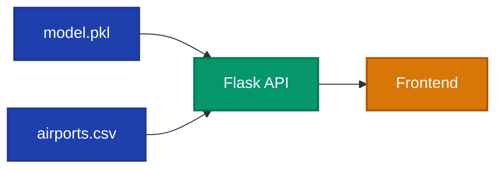

# 🌉 Chapter 2: Build the Bridge

> *"The Oracle speaks only to those who ask correctly. You must build a bridge—an API—so the world can receive its wisdom..."*

---

## 🎯 Your Mission

Your Oracle (model.pkl) holds the power to predict flight delays. But it sits alone in the server folder. You must build **a bridge** (REST API) that lets travelers consult the Oracle.



---

## 📜 The Quest

### 🏆 Success Criteria

You will complete this chapter when you have:

| Task | Reward |
|------|--------|
| ✅ Created `/predict` endpoint | *Travelers can ask the Oracle* |
| ✅ Created `/airports` endpoint | *Travelers know which airports exist* |
| ✅ Returned JSON responses | *Universal language* |
| ✅ API runs successfully | *🌉 The Bridge is open!* |

---

### ⚔️ Part 1: Choose Your Framework

Pick your weapon for building the bridge:

| Framework | Difficulty | Style |
|-----------|------------|-------|
| **Flask** | ⭐ Easy | Simple, minimal |
| **FastAPI** | ⭐⭐ Medium | Modern, auto-docs |
| **Express.js** | ⭐⭐ Medium | JavaScript option |

> 💡 **Recommendation**: Flask is the fastest to build and pairs well with pickle models.

---

### ⚔️ Part 2: Create Dependencies File

First, create `server/requirements.txt` with these dependencies:

```txt
flask>=2.0.0
flask-cors>=3.0.0
scikit-learn>=1.0.0
pandas>=1.3.0
```

Then install them:

```bash
cd server
pip install -r requirements.txt
```

---

### ⚔️ Part 3: Create the Server

1. Create a new file: `server/app.py`
2. Start with a comment describing what you're building:

```python
# Flask API for flight delay prediction
# Endpoints:
#   GET /predict - Returns delay probability
#   GET /airports - Returns list of airports
#   GET /health - Health check
```

**🧪 Try the Scroll of Connection:**
```
Open Copilot Chat and type: #create-api or /create-api
Watch it generate your Flask server!
```

---

### ⚔️ Part 4: Build the Endpoints

#### Endpoint 1: `/predict`

| Property | Value |
|----------|-------|
| Method | GET |
| Parameters | `day_of_week` (1-7), `airport_id` (int) |
| Returns | JSON with delay probability |

**Example request:**
```
GET /predict?day_of_week=1&airport_id=10397
```

**Example response:**
```json
{
  "day_of_week": 1,
  "airport_id": 10397,
  "delay_probability": 0.23
}
```

#### Endpoint 2: `/airports`

| Property | Value |
|----------|-------|
| Method | GET |
| Parameters | None |
| Returns | JSON array of airports |

**Example response:**
```json
[
  {"id": 10397, "name": "Atlanta, GA: Hartsfield-Jackson"},
  {"id": 10423, "name": "Austin, TX: Austin-Bergstrom"}
]
```

---

### ⚔️ Part 4: Enable CORS

The frontend will run on a different port. You need to allow cross-origin requests.

```python
from flask_cors import CORS
app = Flask(__name__)
CORS(app)
```

**💡 Hint:** Ask Copilot: *"Add CORS to my Flask app"*

---

### ⚔️ Part 5: Test the Bridge

Run your server and test the endpoints:

```bash
cd server
python app.py
```

Then open:
- `http://localhost:5000/airports` - Should return airport list
- `http://localhost:5000/predict?day_of_week=1&airport_id=10397` - Should return prediction

---

## 🗝️ Power-Ups to Use

| Artifact | Incantation | How It Helps |
|----------|-------------|--------------|
| ⚡ Scroll of Connection | `#create-api` | Generates Flask API code |
| 🛫 Expert Spirit | `@flight-delay-assistant` | API design help |
| 🧠 Memory Stone | (automatic) | Copilot knows your API needs |

---

## 💡 Ancient Wisdom

<details>
<summary>📜 <b>Wisdom #1:</b> Loading the model</summary>

```python
import pickle

# Load the model
with open('model.pkl', 'rb') as f:
    model = pickle.load(f)

# Make a prediction
prediction = model.predict_proba([[day_of_week, airport_id]])
```

</details>

<details>
<summary>📜 <b>Wisdom #2:</b> Flask basics</summary>

```python
from flask import Flask, request, jsonify

app = Flask(__name__)

@app.route('/airports')
def get_airports():
    # Load airports.csv and return as JSON
    return jsonify(airports_list)

if __name__ == '__main__':
    app.run(debug=True, port=5000)
```

</details>

<details>
<summary>📜 <b>Wisdom #3:</b> Error handling</summary>

```python
@app.route('/predict')
def predict():
    try:
        day = request.args.get('day_of_week', type=int)
        airport = request.args.get('airport_id', type=int)
        
        if not day or not airport:
            return jsonify({"error": "Missing parameters"}), 400
            
        # ... prediction logic
    except Exception as e:
        return jsonify({"error": str(e)}), 500
```

</details>

---

## ✅ Chapter Complete!

When your API responds correctly, you've built the bridge!


**Checklist:**
- [ ] Created `server/requirements.txt` with dependencies
- [ ] Installed dependencies with `pip install -r requirements.txt`
- [ ] Created `server/app.py`
- [ ] `/predict` returns delay probability
- [ ] `/airports` returns airport list
- [ ] CORS is enabled
- [ ] Server runs without errors (`python app.py`)

---

## ➡️ Next Chapter

The bridge is built. Now travelers need a way to cross it—a beautiful portal to consult the Oracle...

> ### [✨ Begin Chapter 3: Reveal the Magic →](./3-create-frontend.md)

---

<details>
<summary>💡 <b>Stuck?</b> Here's help</summary>

**Model not loading?**
- Check the file path to `model.pkl`
- Make sure you're in the `server/` directory

**CORS errors?**
- Install flask-cors: `pip install flask-cors`
- Add `CORS(app)` after creating the Flask app

**Port already in use?**
- Change the port: `app.run(port=5001)`

</details>
