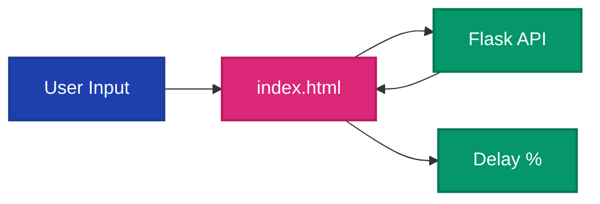
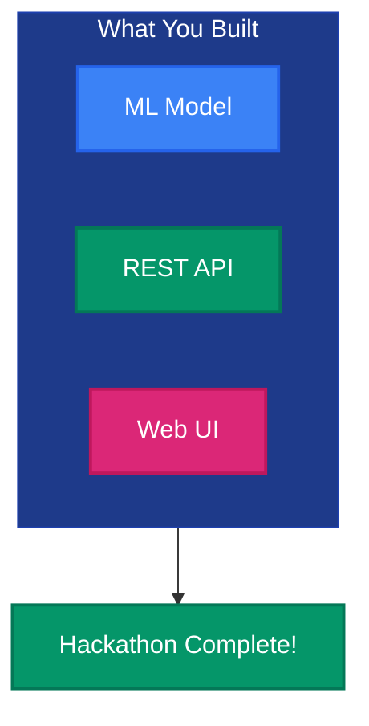
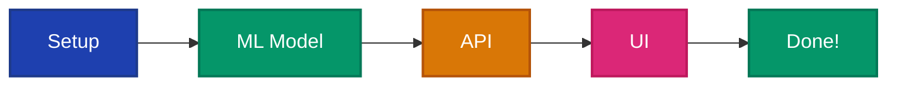

# ✨ Chapter 3: Reveal the Magic

> *"The Oracle speaks. The Bridge stands. Now create a portal—a window through which travelers can glimpse their future..."*

---

## 🎯 Your Mission

You've built the Oracle (model) and the Bridge (API). Now create the **Portal**—a user interface that lets travelers see if their flight will be delayed.



---

## 📜 The Quest

### 🏆 Success Criteria

You will complete this chapter when you have:

| Task | Reward |
|------|--------|
| ✅ Created a UI with day and airport selection | *Travelers can ask questions* |
| ✅ Called your API when user submits | *The Oracle is consulted* |
| ✅ Displayed the prediction result | *🏆 THE TREASURE IS YOURS!* |

---

### 📂 First: Create the Client Folder

Create the folder for your frontend:

```bash
mkdir client
```

Or right-click in VS Code Explorer → New Folder → name it `client`

---

### ⚔️ Part 1: Choose Your Portal Style

This is YOUR creation. Choose what feels right:

| Style | Technology | Difficulty |
|-------|------------|------------|
| **Simple Web** | HTML + CSS + JavaScript | ⭐ Easy |
| **Modern Web** | React, Vue, or Svelte | ⭐⭐ Medium |
| **Mobile** | React Native, Flutter | ⭐⭐⭐ Advanced |

> 💡 **Recommendation**: Start with HTML/CSS/JS—it's fastest and works great!

---

### ⚔️ Part 2: Create the Portal

1. Create a new file: `client/index.html`
2. Design a simple interface with:
   - Dropdown for **Day of Week** (Monday-Sunday)
   - Dropdown for **Airport** (loaded from your API)
   - Button to **Check Delay**
   - Area to display the **Result**

**💡 Hint:** Ask Copilot: *"Create an HTML form with dropdowns for day of week and airports"*

---

### ⚔️ Part 3: Load Airports from API

When the page loads, fetch airports from your API:

```javascript
// Fetch airports and populate dropdown
fetch('http://localhost:5000/airports')
  .then(response => response.json())
  .then(airports => {
    // Populate the dropdown
  });
```

---

### ⚔️ Part 4: Get Predictions

When the user clicks the button, call the predict endpoint:

```javascript
// Call the prediction API
const day = document.getElementById('day').value;
const airport = document.getElementById('airport').value;

fetch(`http://localhost:5000/predict?day_of_week=${day}&airport_id=${airport}`)
  .then(response => response.json())
  .then(result => {
    // Display the prediction
  });
```

---

### ⚔️ Part 5: Display Results Beautifully

Make the result meaningful to travelers:

| Probability | Display | Color |
|-------------|---------|-------|
| 0-20% | "Low risk of delay! ✈️" | Green |
| 20-40% | "Moderate risk 🤔" | Yellow |
| 40%+ | "High delay risk! ⚠️" | Red |

---

### ⚔️ Part 6: Run Your Frontend

**Option A: Open directly in browser**
- Right-click `client/index.html` in VS Code
- Select "Open with Live Server" (if extension installed)
- Or just double-click the file to open in your default browser

**Option B: Use Python's built-in server**
```bash
cd client
python -m http.server 8080
```
Then open: `http://localhost:8080`

**⚠️ Important**: Make sure your Flask API is running first!
```bash
cd server
python app.py
```

---

## 🗝️ Power-Ups to Use

| Artifact | How It Helps |
|----------|--------------|
| 🧠 Memory Stone | Copilot knows your API structure |
| 🛫 Expert Spirit | `@flight-delay-assistant Help with frontend` |

---

## 💡 Ancient Wisdom

<details>
<summary>📜 <b>Wisdom #1:</b> Basic HTML structure</summary>

```html
<!DOCTYPE html>
<html>
<head>
    <title>Flight Delay Predictor</title>
    <style>
        /* Add your styles here */
    </style>
</head>
<body>
    <h1>✈️ Flight Delay Predictor</h1>
    
    <select id="day">
        <option value="1">Monday</option>
        <!-- More days -->
    </select>
    
    <select id="airport">
        <!-- Loaded from API -->
    </select>
    
    <button onclick="predict()">Check Delay Risk</button>
    
    <div id="result"></div>
    
    <script>
        // Your JavaScript here
    </script>
</body>
</html>
```

</details>

<details>
<summary>📜 <b>Wisdom #2:</b> Styling ideas</summary>

```css
body {
    font-family: Arial, sans-serif;
    max-width: 600px;
    margin: 0 auto;
    padding: 20px;
}

.low-risk { color: green; }
.medium-risk { color: orange; }
.high-risk { color: red; }
```

</details>

<details>
<summary>📜 <b>Wisdom #3:</b> Running the frontend</summary>

You can open `index.html` directly in a browser, or:

```bash
# Simple Python server
cd client
python -m http.server 8080
```

Then open `http://localhost:8080`

</details>

---

## 🏆 TREASURE CLAIMED!

When a traveler can select a day and airport, click a button, and see their delay prediction...

### 🎯 The Real Treasure

This is what your completed Flight Delay Predictor will look like:


*A beautiful, working prediction app that tells travelers their flight delay risk!*

---

**Final Checklist:**
- [ ] Created `client/` folder
- [ ] Created `client/index.html`
- [ ] Day of week dropdown works
- [ ] Airport dropdown loads from API
- [ ] Submit button calls `/predict` endpoint
- [ ] Result displays with color-coded risk level
- [ ] Flask API is running (`python server/app.py`)
- [ ] Frontend is accessible in browser



**You have achieved:**
- [x] 🔮 Built a machine learning model from 271K flight records
- [x] 🌉 Created an API to expose predictions
- [x] ✨ Built a user interface for travelers
- [x] 🤖 Mastered AI-assisted development with GitHub Copilot
- [x] 🗝️ Learned to configure Copilot for any future project

---

## 🎉 Congratulations, Adventurer!

You've completed the Flight Delay Treasure Hunt!



### What You've Learned

| Skill | How You Learned It |
|-------|-------------------|
| **Data Science** | Explored and cleaned 271K records |
| **Machine Learning** | Trained a Logistic Regression model |
| **API Development** | Built REST endpoints with Flask |
| **Frontend Development** | Created an interactive UI |
| **AI-Assisted Coding** | Partnered with GitHub Copilot |
| **Copilot Configuration** | Used instructions, prompts, and agents |

### The Real Treasure

> *"The treasure was never just the app. It was the developer you became along the way."*

You now know how to:
- Configure Copilot for ANY project
- Use prompt files for reusable workflows
- Create custom agents for specialized help
- Let AI amplify your abilities, not replace them

---

## 🚀 What's Next?

Your adventure doesn't end here. Consider:

- 🎨 **Polish**: Add more styling, animations, error states
- 📊 **Expand**: Add more features from the dataset
- 🧪 **Test**: Add unit tests for your API
- 📱 **Mobile**: Create a mobile version
- 🚀 **Deploy**: Deploy to Azure, Vercel, or Heroku

---

<div align="center">

### 🏴‍☠️ THE END 🏴‍☠️

*Thank you for playing!*

[🏠 Return to Treasure Map](../hackathon.md)

</div>
