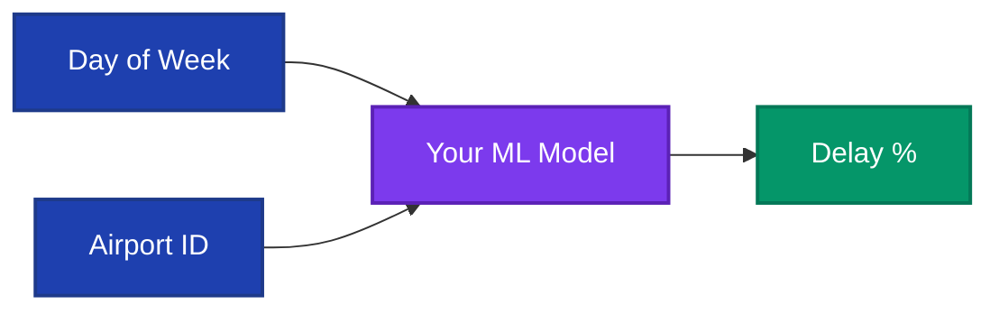
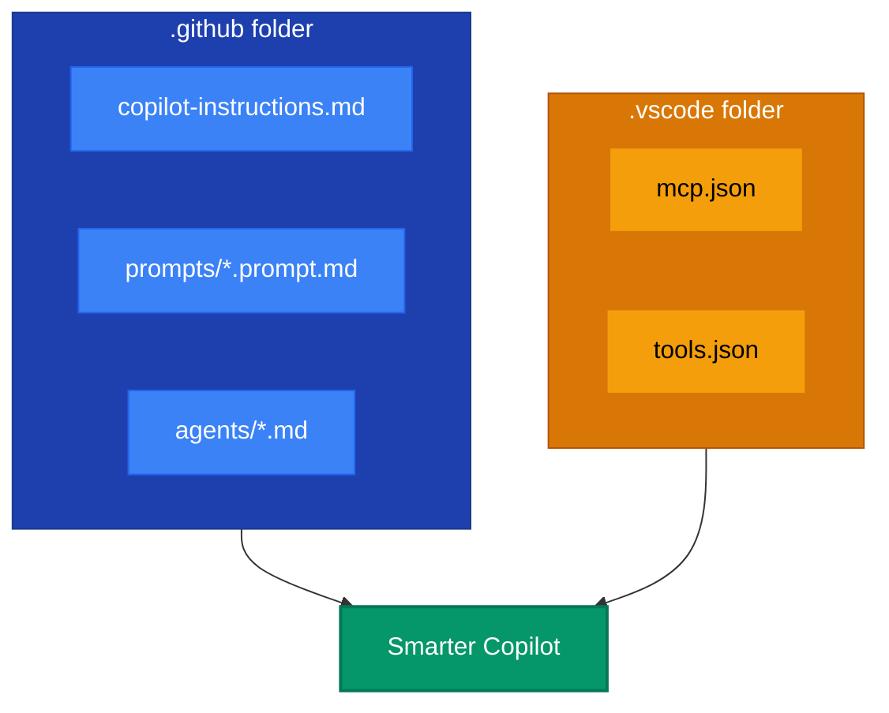

# ✈️ Flight Delay Prediction Hackathon

> **Your Mission**: Build an AI-powered flight delay prediction app using GitHub Copilot

---

## 🗺️ The Legend

*Deep within the FAA archives lies a treasure trove of secrets—271,000 flight records holding the patterns of time itself. Airlines have searched for decades to unlock the mystery: "Which flights will be delayed?"*

*Today, you become a **Data Explorer**. Armed with GitHub Copilot as your AI companion, you will:*

1. 🔮 **Decode the Oracle** — Train a machine learning model to see the future
2. 🌉 **Build the Bridge** — Create an API that shares the Oracle's wisdom  
3. ✨ **Reveal the Magic** — Craft a portal where travelers discover their fate

*The treasure? A working prediction app—and the skills to build AI-powered solutions.*

*Your journey begins now...*

---

## 🎯 The Challenge

You have a dataset with **271,000+ flight records** from the FAA. Build an application that predicts:

> *"What's the probability my flight will be delayed more than 15 minutes?"*



---

## 📁 What You'll Create

During this hackathon, you will create the following files and folders:

```
flight-delay-hackathon/
│
├── 📓 manage-flight-data.ipynb    ← Chapter 1: Your Jupyter Notebook
│
├── 📂 server/                     ← Create this folder in Chapter 1
│   ├── model.pkl                  ← Chapter 1: Trained ML model (exported)
│   ├── airports.csv               ← Chapter 1: Airport lookup data (exported)
│   ├── app.py                     ← Chapter 2: Flask API server
│   └── requirements.txt           ← Chapter 2: Python dependencies
│
├── 📂 client/                     ← Create this folder in Chapter 3
│   └── index.html                 ← Chapter 3: Web frontend
│
└── 📂 data/                       ← Already exists!
    └── flights.csv                ← Source dataset (271K records)
```

### Files You'll Create by Chapter

| Chapter | Files to Create | Location |
|---------|-----------------|----------|
| **Ch 1: ML Model** | `manage-flight-data.ipynb` | Root folder |
| **Ch 1: ML Model** | `server/` folder | Create new folder |
| **Ch 1: ML Model** | `model.pkl`, `airports.csv` | Export to `server/` |
| **Ch 2: API** | `app.py` | `server/` folder |
| **Ch 2: API** | `requirements.txt` | `server/` folder |
| **Ch 3: Frontend** | `client/` folder | Create new folder |
| **Ch 3: Frontend** | `index.html` | `client/` folder |

---

## 📋 Technical Overview

| Component | Technology | Output |
|-----------|------------|--------|
| **Data & ML** | Python, pandas, scikit-learn | `model.pkl`, `airports.csv` |
| **API Server** | Flask with CORS | REST endpoints |
| **Frontend** | HTML/CSS/JavaScript | User interface |

---

## 🔑 GitHub Copilot Power-Ups

**Before starting**, discover the **GitHub Copilot configurations** we've set up for you!

These files are already active and will make Copilot 10x more helpful:



### Quick Commands to Try Now

| Command | What It Does |
|---------|--------------|
| Ask: *"What columns are in the dataset?"* | Copilot uses project context from `copilot-instructions.md` |
| Type: `#explore-data` or `/explore-data` | Loads data exploration prompt |
| Type: `#build-model` or `/build-model` | Loads ML model building prompt |
| Type: `#create-api` or `/create-api` | Loads API creation prompt |
| Type: `@flight-delay-assistant` | Talks to project-specific agent |

> 💡 **Both `#` and `/` work for prompts!** `#` adds context, `/` runs directly.

> ### 👉 [Explore GitHub Copilot Power-Ups in Detail](./.github/github-copilot-power-ups.md)

---

## 🗺️ Your Journey: 4 Chapters

Complete each chapter in order. Each builds on the previous one.


| Chapter | What You'll Build | Key Deliverables |
|:-------:|-------------------|------------------|
| **0** | Setup Environment | VS Code ready, Copilot working |
| **1** | Data & ML Model | `model.pkl`, `airports.csv` |
| **2** | REST API | `/predict` and `/airports` endpoints |
| **3** | Frontend UI | Working web application |

---

## 🛠️ Technical Requirements

### Dataset Columns (`data/flights.csv`)

| Column | Type | Description |
|--------|------|-------------|
| `DayOfWeek` | int | 1 (Monday) to 7 (Sunday) |
| `DestAirportID` | int | Unique airport identifier |
| `DestAirportName` | string | Full airport name |
| `ArrDel15` | binary | **TARGET**: 1 = delayed >15 min, 0 = on time |
| `ArrDelay` | float | Delay in minutes (negative = early) |
| `DepDel15` | binary | 1 = departure delayed >15 min |
| `DepDelay` | float | Departure delay in minutes |
| `Carrier` | string | Airline code (AA, UA, DL, etc.) |

### API Specification

| Endpoint | Method | Parameters | Response |
|----------|--------|------------|----------|
| `/predict` | GET | `day_of_week` (1-7), `airport_id` (int) | `{"delay_probability": 0.23}` |
| `/airports` | GET | None | `[{"id": 10397, "name": "Atlanta..."}]` |

### ML Model Requirements

- **Features**: `DayOfWeek`, `DestAirportID`
- **Target**: `ArrDel15`
- **Algorithm**: Logistic Regression (recommended)
- **Output**: Probability (0.0 to 1.0)

---

## 💡 Tips for Success

### Working with Copilot

1. **Use comments to describe what you want**:
   ```python
   # Load flights.csv and show the first 10 rows
   ```

2. **Open relevant files** before asking questions (Copilot uses open files as context)

3. **Iterate on suggestions** - first attempt may not be perfect

4. **Use the prompt files** (`#explore-data`, `#build-model`, `#create-api`)

### Debugging Tips

- **API not responding?** Check CORS is enabled
- **Model not loading?** Verify file path and pickle format
- **Predictions wrong?** Check feature names match training

---

## 🏆 The Real Treasure

When you complete all chapters, this is what you'll build:


*A fully working Flight Delay Predictor app — your treasure awaits!*

---

## 🏁 Ready to Start?

> ### [👉 Begin Chapter 0: Setup Your Environment](./content/0-get-started.md)

---

## 📖 Additional Resources

- [Copilot Tips & Tricks](./copilot-tips.md)
- [GitHub Copilot Documentation](https://docs.github.com/en/copilot)
- [Flask Documentation](https://flask.palletsprojects.com/)
- [scikit-learn Documentation](https://scikit-learn.org/)
